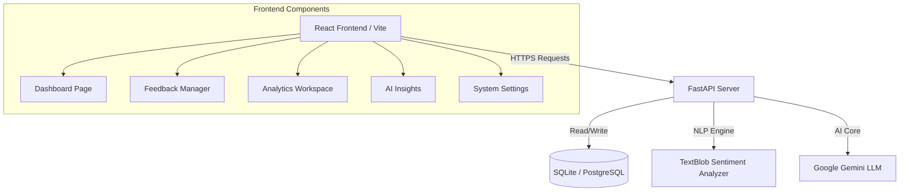

# Feedback Intelligence System 🔮

A production-quality, AI-powered customer feedback intelligence platform that automatically collects, analyzes, and visualizes customer reviews. The system uses FastAPI and NLP pipelines on the backend, Google Gemini AI for advanced insights, and a sleek, Vercel/Linear-inspired React dashboard on the frontend.

## Key Features

- **Feedback Ingestion & CRUD**: Submit and manage customer reviews. Instantly analyzes sentiment (Positive, Negative, Neutral), classifies category (Bug, Feature Request, Complaint, Praise, General), and assigns priority scores (1-5).
- **Interactive Analytics Workspace**: Chart.js visualizations showing volume trends, sentiment distribution, category breakdowns, topic distribution, and NLP keyword frequencies.
- **Anomaly Detection**: 14-day rolling window detection triggers alert tags for high, medium, and low volume anomalies.
- **Gemini AI Intelligence Command**: Generates executive summaries, analytical root causes, and interactive action item checklists.
- **Operational Health System**: Pulser tags and status cards monitoring FastAPI Server, SQLite Database, and Gemini AI status.
- **Demo Seeding Engine**: Ingest preconfigured mock customer reviews to demonstrate real-time metrics and charts.
- **Light & Dark Mode**: Persistent theme settings configured with standard Tailwind CSS.

---

## Architecture Overview



---

## Tech Stack

- **Frontend**: React 18, Vite, Tailwind CSS v3, Chart.js, Axios, React Router v6, Heroicons.
- **Backend**: Python 3.12, FastAPI, Uvicorn, SQLAlchemy ORM.
- **Database**: SQLite (Development), PostgreSQL (Production-ready).
- **AI/NLP**: Google Generative AI (Gemini 1.5 Flash), TextBlob (local sentiment analysis).
- **Deployment**: Docker, Docker Compose, ready for Vercel (Frontend) and Railway/Render (Backend).

---

## Installation & Setup

### Prerequisites
- Node.js (v18+) and NPM
- Python (v3.10+)

### 1. Configure the Backend

1. Navigate to the `backend` folder:
   ```bash
   cd backend
   ```
2. Create and activate a virtual environment:
   ```bash
   python -m venv venv
   # Windows PowerShell
   .\venv\Scripts\Activate.ps1
   # macOS/Linux
   source venv/bin/activate
   ```
3. Install Python dependencies:
   ```bash
   pip install -r requirements.txt
   ```
4. Configure environment variables. Copy `.env.example` to `.env`:
   ```bash
   cp .env.example .env
   ```
   Edit `.env` and set your `GEMINI_API_KEY`. (AI features are bypassed gracefully if this key is missing).
5. Start the FastAPI server:
   ```bash
   uvicorn app.main:app --reload
   ```
   The API will run at `http://localhost:8000`. Swagger documentation is available at `http://localhost:8000/docs`.

### 2. Configure the Frontend

1. Open a new terminal and navigate to the `frontend` folder:
   ```bash
   cd frontend
   ```
2. Install Node packages:
   ```bash
   npm install
   ```
3. Start the Vite development server:
   ```bash
   npm run dev
   ```
   Open `http://localhost:5173` in your browser.

---

## Docker Deployment (Unified)

Deploy both services in containers:
1. Create a `.env` file in the root directory and add:
   ```env
   GEMINI_API_KEY=your_gemini_api_key_here
   ```
2. Build and start the services:
   ```bash
   docker-compose up --build
   ```
3. Access:
   - Frontend: `http://localhost:5173`
   - Backend API: `http://localhost:8000`
   - Swagger Documentation: `http://localhost:8000/docs`

---

## API Endpoints Summary

- `GET /health` - System operational status.
- `POST /feedback` - Submit new feedback.
- `GET /feedback` - List all feedback (supports search, category, sentiment, and priority parameters).
- `GET /feedback/{id}` - Inspect specific feedback.
- `PUT /feedback/{id}` - Update feedback.
- `DELETE /feedback/{id}` - Delete feedback.
- `GET /analytics/overview` - Keyword counts, daily counts, anomalies, and topic mapping.
- `GET /dashboard/overview` - Combined KPI and analytics dashboard metrics.
- `GET /dashboard/sentiment-timeline` - Sentiment history.
- `GET /dashboard/priority-breakdown` - Feedback distribution by priority.
- `GET /insights/executive-summary` - Gemini-generated high-level executive report.
- `GET /insights/ai-analysis` - Gemini-generated root causes.
- `GET /insights/action-items` - Gemini-generated prioritized action recommendations.

---

## Production Deployment Checklist

- [x] Configure CORS on FastAPI Backend to allow production client domains.
- [ ] Set `ENVIRONMENT=production` and `DEBUG=False` in backend environment variables.
- [ ] Bind production database URI (e.g. PostgreSQL) in `DATABASE_URL`.
- [ ] Deploy Frontend on Vercel (build command: `npm run build`, output directory: `dist`).
- [ ] Deploy Backend on Render/Railway/Fly.io.
