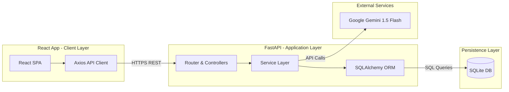
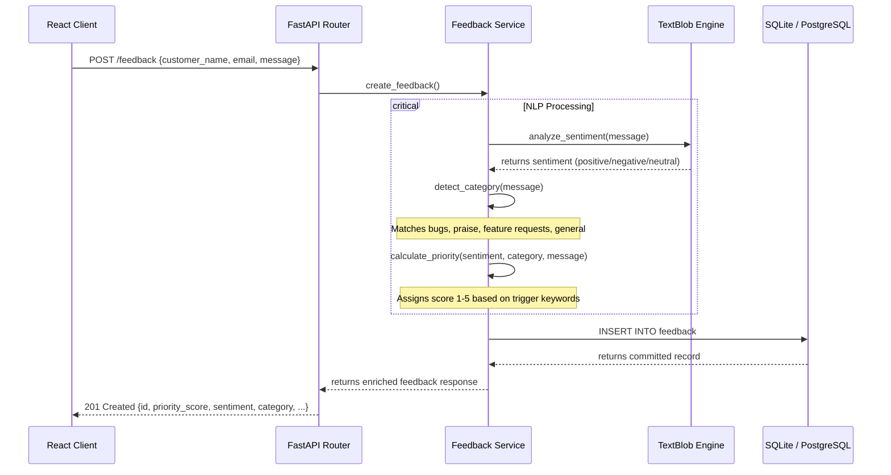
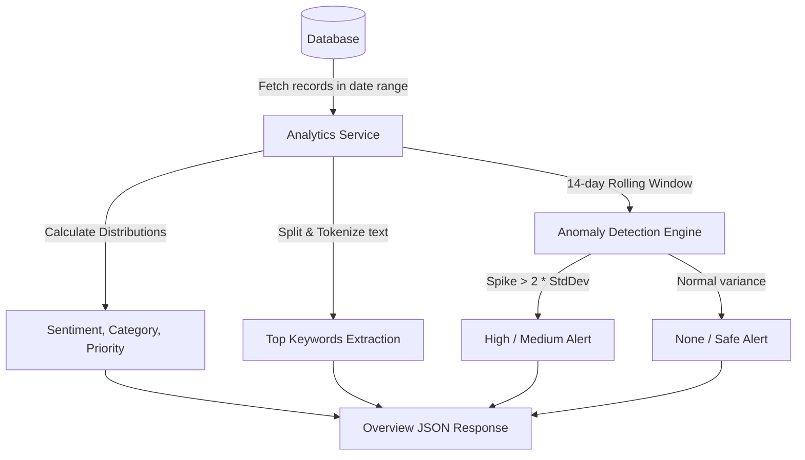

# Architecture Diagram & System Design

This document details the system design, components, and data pipelines of the **Feedback Intelligence System**.

---

## 1. System Topology

The platform is designed around a decoupled, 2-tier client-server architecture:

---

## 2. Ingestion & Analysis Data Pipeline

When a user submits a feedback item (either through the browser form or an external endpoint), it undergoes automatic parsing and enrichment:

---

## 3. Analytics & Anomaly Detection Pipeline

Analytics are calculated dynamically to support dashboard KPIs and timeline reports:

---

## 4. Components Directory Structure

- **`frontend/`**: Single Page React Application initialized with Vite.
  - `src/api/`: API wrapper layer using Axios.
  - `src/components/`: Reusable widgets (Sidebar, Header, Details Modal).
  - `src/pages/`: Core views (Dashboard, Feedback Stream, Analytics, AI Insights, Settings).
  - `src/App.jsx`: Root router and light/dark theme provider.
- **`backend/`**: FastAPI REST backend.
  - `app/api/`: Routes definition.
  - `app/database/`: SQLAlchemy base, connection engine, and tables.
  - `app/schemas/`: Pydantic validation schemas.
  - `app/services/`: Core logic engines (analytics.py, dashboard.py, feedback.py, gemini.py).
